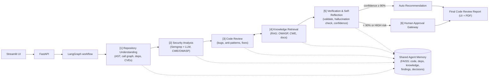

# TRIAVANI — AI Software Code Reviewer & Secure Development Agent

**Hackathon Problem Statement #06**

TRIAVANI is an agentic AI system that reviews software repositories end‑to‑end. It understands repository structure, detects bugs and security vulnerabilities, retrieves secure‑coding knowledge, generates explainable review comments and fixes, self‑verifies its own suggestions, and routes high‑risk changes through a human approval gateway.

> "A senior reviewer + security engineer in a box — with receipts (explainability) and a safety valve (human‑in‑the‑loop)."

Related documents in the repo: `Hackathon_Problem_Statement.pptx` (full PRD) and `docs/architecture.md`.

---

## Table of Contents

1. [Goals](#goals-hackathon-scope)
2. [Architecture](#architecture-6-agent-pipeline)
3. [Data Contracts](#data-contracts)
4. [Module Status](#module-status)
5. [Module A — Ingestion & Repository Understanding](#module-a--ingestion--repository-understanding)
6. [Module B — Analysis & Knowledge Agents](#module-b--analysis--knowledge-agents)
7. [Module C — Orchestration, Verification & Experience](#module-c--orchestration-verification--experience)
8. [Repository Layout](#repository-layout)
9. [Local Setup](#local-setup)
10. [Docker Setup](#docker-setup)
11. [Configuration / Environment Variables](#configuration--environment-variables)
12. [API Reference](#api-reference)
13. [LLM Providers](#llm-providers)
14. [Demo & Test Data](#demo--test-data)
15. [Tests and Lint](#tests-and-lint)
16. [Design Decisions](#design-decisions)
17. [Team Rules / Handoff](#team-rules--handoff)
18. [Fine-Tuned LLM Development for Agent Replacement](#fine-tuned-llm-development-for-agent-replacement)

---

## Goals (Hackathon Scope)

| # | Goal | Metric |
|---|------|--------|
| G1 | Ingest a GitHub/GitLab repo or PR and build a code context | Works on ≥2 languages (Python + Java) |
| G2 | Detect bugs, vulnerabilities & anti-patterns | Detect ≥70% of seeded issues in demo repo |
| G3 | Generate explainable reviews + suggested fixes | Every finding has Why + How + reference |
| G4 | Verifier agent scores confidence; low-confidence/high-risk → human approval | Confidence gate at 90% threshold |
| G5 | One-click Code Review Report (UI + PDF export) | Full report in < 5 min per PR |

**Non-goals:** auto-merging without human approval, model fine-tuning, more than 3 languages, production CI/CD.

---

## Architecture (6-Agent Pipeline)



**Pipeline order:**

```
START -> ingest_repository -> security_analysis -> code_review -> knowledge_retrieval
      -> verification -> decision_gateway -> build_report -> END
```

LangGraph is used when installed; a sequential fallback keeps local tests runnable without it. Module A's ingestion output is real and working today. Downstream agents (B & C) currently run against Semgrep-when-available, a `MockLLMProvider`, and local OWASP/CWE notes, so the end-to-end demo runs without any API keys. Real Module B/C implementations can be swapped in with zero pipeline changes because the contracts are frozen.

The repository under review is treated as **untrusted input**: TRIAVANI reads source text and generates patch *suggestions*, but never executes target repository code and never auto-applies patches.

---

## Data Contracts

All modules communicate **only** through frozen JSON/Pydantic v2 contracts defined in `packages/contracts/` (`models.py`, `enums.py`, and JSON Schemas under `packages/contracts/schemas/`).

### C1 — `CodeContext` (Module A → B, C)

| Field | Type | Notes |
|---|---|---|
| `repo` | `RepoInfo` | `url`, `branch`, `commit` |
| `files` | `FileSummary[]` | `path`, `language`, `loc` |
| `functions` | `FunctionInfo[]` | `id`, `file`, `name`, `start_line`, `end_line`, `code`, `callers[]`, `callees[]` |
| `dependencies` | `DependencyInfo[]` | `name`, `version`, `known_cves[]` |
| `diff` | `DiffHunk[]` | `file`, `hunks[]` (PR diff) |
| `vector_store_path` | `string` | path to the Shared Agent Memory (FAISS) |

### C2 — `Finding[]` (Module B → C)

| Field | Type | Notes |
|---|---|---|
| `id` | `string` | |
| `type` | `FindingType` | `security` \| `bug` \| `quality` \| `style` |
| `severity` | `Severity` | `critical` \| `high` \| `medium` \| `low` |
| `file`, `start_line`, `end_line` | | location |
| `title` | `string` | |
| `explanation_why` | `string` | |
| `explanation_how_to_fix` | `string` | |
| `suggested_patch` | `string` | |
| `cwe_id`, `owasp_ref` | `string` | references |
| `cvss_score` | `float \| null` | 0.0–10.0 |
| `cvss_vector` | `string` | |
| `taint_flow` | `string[]` | |
| `references` | `string[]` | |
| `source_agent` | `SourceAgent` | `security` \| `review` |
| `raw_confidence` | `float` | 0.0–1.0 |
| `verification_result` | `string` | |
| `approval_required` | `bool` | |
| `approval_status` | `ApprovalStatus` | `pending` \| `approved` \| `rejected` |

### C3 — `ReviewReport` (Module C → user)

| Field | Type | Notes |
|---|---|---|
| `scores` | `Scores` | `security` (0–100), `quality` (0–100), `confidence` (0.0–1.0), `risk_level` (`LOW`/`MEDIUM`/`HIGH`) |
| `findings` | `Finding[]` | verified findings |
| `verified` | `bool` | |
| `hallucination_flags` | `string[]` | |
| `approval` | `Approval` | `required`, `status`, `approver`, `timestamp` |
| `summary` | `string` | |

### Supporting request/response models

- `ReviewRunRequest` — `repo_path`, `repo_url`, `branch` (default `"main"`), `use_mock` (default `true`)
- `ReviewRunResponse` — `run_id`, `status`, `report`, `progress_events[]`, `errors[]`
- `StoredRun` — persisted run record (`run_id`, `created_at`, `repo_input`, `report`, `progress_events[]`, `errors[]`)

Each module ships a mock so the others are never blocked:

- `packages/contracts/mocks/mock_code_context.json` (Module A)
- `packages/contracts/mocks/mock_findings.json` (Module B)
- `packages/contracts/mocks/mock_review_report.json` (Module C)

**Contracts C1–C3 are frozen** — breaking any of them requires all-hands agreement.

---

## Module Status

| Module | Scope | Owner | Status |
|--------|-------|-------|--------|
| **A — Ingestion & Repository Understanding** | `services/ingestion` (agent #1 + Shared Agent Memory) | Person 1 | ✅ Implemented & working |
| **B — Analysis & Knowledge Agents** | `services/analysis`, `services/knowledge` (agents #2–#4) | Person 2 | 🚧 Scaffolding — runs on Semgrep-when-available + mock LLM fallback |
| **C — Orchestration, Verification & Experience** | `services/orchestration`, `services/verification`, `services/reporting`, `apps/` (agents #5–#6, UI/report) | Person 3 | 🚧 Scaffolding — pipeline wiring, mock-based verification, UI/PDF export |

---

## Module A — Ingestion & Repository Understanding

Builds the **CodeContext (C1)** and the **Shared Agent Memory** consumed by Modules B and C.

**Definition of done** (PRD: repo URL → C1 JSON + vector store in < 2 minutes) — measured **3.4 s cold** (fresh shallow clone) on `gothinkster/flask-realworld-example-app`: 30 files, 123 functions, 20 dependencies with OSV CVEs (parse 0.42 s, deps 0.04 s, embed 0.07 s; remainder is network clone time). Per-stage timings are written to `<vector_store_path>/repo_insights.json` under `timings_seconds` on every run.

### Entry points

**Orchestration (stable integration point — frozen alongside the C1 contract):**

```python
from services.ingestion.repository_loader import load_repository   # request -> local Path
from services.ingestion.code_context_builder import build_code_context
ctx = build_code_context(repo_path, run_id, branch)                 # -> CodeContext (pydantic)
```

**CLI (URL or local path in, C1 JSON out):**

```powershell
python -m services.ingestion.cli <repo_url_or_path> [--pr N] [--branch NAME] [--out FILE]

# examples
python -m services.ingestion.cli https://github.com/org/repo --pr 42 --out code_context.json
python -m services.ingestion.cli https://gitlab.com/group/proj --pr 7   # GitLab MR (IID)
python -m services.ingestion.cli tests/fixtures/sample_java
```

`--pr` works for both GitHub PRs and GitLab MRs (nested groups supported; for GitLab, pass the MR IID). Set `GITHUB_TOKEN` for GitHub PR mode (unauthenticated API limit is 60 req/hr) and `GITLAB_TOKEN` for private GitLab projects.

### What Modules B & C get

- **C1 CodeContext**: `repo`, `files[]`, `functions[]` (with resolved `callers`/`callees`), `dependencies[]` (with `known_cves` from OSV.dev, CVE IDs preferred), `diff[]` (PR hunks), `vector_store_path`. Validated against `services/ingestion/schemas/code_context.schema.json`, a stricter superset of the frozen contract in `packages/contracts/schemas/`.
- **Shared Agent Memory** (`services.ingestion.memory.SharedMemory`):

  ```python
  from services.ingestion.memory import SharedMemory
  mem = SharedMemory(ctx.vector_store_path)             # embedder auto-restored
  hits = mem.search("code", "how are passwords hashed", k=5)
  mem.add("secure_knowledge", texts, metadata)           # Module B writes here
  mem.add("findings", ...); mem.add("decisions", ...)    # Modules B/C write here
  mem.save()
  ```

  Collections: `code`, `deps` (written by A); `secure_knowledge` (B); `findings` (B/C); `decisions` (C). Backend is FAISS with a numpy fallback; embeddings use MiniLM if `sentence-transformers` is installed, otherwise a hashing embedder — chosen automatically and recorded in `manifest.json`.
- **Repo insights** (`<vector_store_path>/repo_insights.json`): `module_map` (architecture overview), per-function `complexity`, `diff_touched_functions`, `recent_commits`, `timings_seconds`.
- **Scope capping** for large repos:

  ```python
  from services.ingestion import graphs
  ids = graphs.neighbors(functions, seed_ids=set(touched), hops=2)
  ```

### Layout (`services/ingestion/`)

| File | Purpose |
|---|---|
| `config.py` | Caps/paths/languages; defaults from `packages.shared.config`, overridable via `INGEST_*` env vars |
| `fetcher.py` | Clone (cached under `data/repos/cache`), GitHub PR diff, commit metadata |
| `parser.py` | Tree-sitter → functions/classes/imports (Python, Java) |
| `graphs.py` | Call graph, N-hop neighbors, module map, diff mapping |
| `dependencies.py` | `requirements`/`pyproject`/`pom`/`gradle`/`Dockerfile` → OSV CVEs (responses cached under `data/osv_cache`) |
| `memory.py` | Namespaced vector store (FAISS/numpy) under `data/faiss` |
| `embedder.py` | MiniLM or hashing embeddings; code/doc/dep chunking |
| `context_builder.py` | Pipeline assembly + schema validation + insights |
| `code_context_builder.py` | Pydantic adapter used by `services.orchestration` |
| `repository_loader.py` | Request → local path (local dir or shallow clone) |
| `git_ingestion.py` / `local_path_ingestion.py` / `file_filter.py` | Loading + filtering helpers |
| `schemas/` | Detailed C1 schema (Module A-owned; superset of the frozen contract) |

**Tests:** `tests/unit/test_ingestion_*.py`, `tests/integration/test_ingestion_pipeline.py`; fixtures in `tests/fixtures/sample_py` and `tests/fixtures/sample_java` (seeded issues: SQL injection, `eval`, DES/ECB, card-number logging, Log4Shell dependency). OSV and clone caches keep re-runs offline-safe for live demos.

---

## Module B — Analysis & Knowledge Agents

Module B owns static security analysis, deterministic code review, and secure-coding knowledge retrieval (agents #2–#4).

### `services/analysis`

- `analyzer.py` exposes `analyze_code_context(code_context, repo_root=None)`.
- `semgrep_runner.py` (`SemgrepRunner`) runs `semgrep scan --json` using `services/analysis/rules/semgrep.yml`.
- `security_agent.py` (`SecurityAnalysisAgent`) converts Semgrep results and deterministic scans into `Finding` objects.
- `review_agent.py` (`CodeReviewAgent`) uses `MockLLMProvider` by default, so no API keys are required to run.
- Other modules: `risk_metadata.py`, `severity_mapper.py`, `llm_provider.py`, `finding_normalizer.py`.
- CodeQL is a planned future adapter and is intentionally **not** required for the first demo.

### `services/knowledge`

The first knowledge retriever loads local Markdown seed documents (`seed_docs/owasp_top_10.md`, `cwe_reference.md`, `secure_python.md`, `secure_java.md`) and matches keywords against a finding's title, CWE, OWASP reference, type, and explanations. It attaches local references such as:

- `OWASP Top 10: A03 Injection`
- `CWE-89: SQL Injection`
- `Secure Python: Avoid shell=True`

`rag_index.py` is a placeholder for a future FAISS-backed retriever. `knowledge_retriever.py` and `rag_ingestion.py` implement the current retrieval logic.

---

## Module C — Orchestration, Verification & Experience

Owns the LangGraph workflow, verification/self-reflection, human approval gating, reporting, the FastAPI backend, and the Streamlit UI (agents #5–#6).

### `services/orchestration`

- `graph.py` — defines the LangGraph workflow.
- `run_pipeline.py` — exposes `run_pipeline(...)`, the **stable team integration point**.
- `state.py` — shared pipeline state.
- `nodes/` — one node per pipeline stage: `ingest_node.py`, `security_node.py`, `review_node.py`, `retrieval_node.py`, `verification_node.py`, `decision_node.py`, `report_node.py`.

### `services/verification`

Validates file references, patch shape, confidence scores, hallucination flags, and human-approval routing.

- `verifier_agent.py` — orchestrates verification.
- `confidence_scorer.py` — computes confidence.
- `risk_gateway.py` — routes findings to the human approval gate (confidence < 90% or HIGH risk).
- `patch_validator.py` — validates suggested patches.
- `hallucination_checks.py` — flags likely hallucinated findings.

### `services/reporting`

Builds review reports, exports Markdown/PDF files, and persists run metadata and approvals in SQLite.

- `report_builder.py` — assembles the `ReviewReport`.
- `markdown_exporter.py` — `render_markdown_report(...)`.
- `pdf_exporter.py` — PDF export (via `reportlab`).
- `repository.py` — SQLite persistence: `get_run`, `get_approvals`, `update_approval`, etc.

### `apps/api` (FastAPI)

- `main.py` — app entry point, health endpoint.
- `api/reviews.py` — review run endpoints (see [API Reference](#api-reference)).
- `settings.py`, `dependencies.py` — configuration and DI.
- `Dockerfile` — container build for the API service.

### `apps/ui` (Streamlit)

- `streamlit_app.py` — the UI for kicking off runs, viewing reports, and approving/rejecting findings.
- `Dockerfile` — container build for the UI service.

---

## Repository Layout

```
packages/
  shared/          config.py, security.py, logging.py, utils.py — cross-cutting helpers
  contracts/       enums.py, models.py, schemas/, mocks/ — the frozen C1–C3 contracts
services/
  ingestion/       Module A — repository understanding + Shared Agent Memory
  analysis/        Module B — Semgrep + LLM security/code-review agents
  knowledge/       Module B — OWASP/CWE knowledge retrieval
  orchestration/   Module C — LangGraph workflow, run_pipeline entry point
  verification/    Module C — confidence scoring, hallucination checks, approval routing
  reporting/       Module C — report building, Markdown/PDF export, SQLite persistence
apps/
  api/             FastAPI backend
  ui/               Streamlit frontend
tests/
  unit/            per-module unit tests
  integration/     pipeline/API smoke tests
  contract/        contract validation tests
  fixtures/        sample_py, sample_java code fixtures with seeded issues
demo_repos/
  vulnerable_python_java_demo/   seeded demo repo (Python + Java) for live demos
data/
  sqlite/          run/approval persistence
  reports/         generated Markdown/PDF reports
  faiss/           Shared Agent Memory vector store
docs/
  architecture.md, api.md, decisions.md, team_handoff.md
docker-compose.yml, Makefile, pyproject.toml, requirements.txt, .env.example
Hackathon_Problem_Statement.pptx   full product requirements
```

---

## Local Setup

```bash
python3 -m venv .venv
source .venv/bin/activate      # Windows: .venv\Scripts\activate
pip install -r requirements.txt
make run-api
make run-ui
```

- FastAPI docs: http://localhost:8000/docs
- Streamlit UI: http://localhost:8501
- Health check: http://localhost:8000/health

`Makefile` targets:

| Target | Command |
|---|---|
| `run-api` | `uvicorn apps.api.app.main:app --reload --port 8000` |
| `run-ui` | `API_BASE_URL=http://localhost:8000 streamlit run apps/ui/streamlit_app.py` |
| `test` | `pytest` |
| `lint` | `ruff check .` |
| `docker-up` | `docker compose up --build` |

---

## Docker Setup

```bash
docker compose up --build
```

`docker-compose.yml` defines two services:

- **api** — built from `apps/api/Dockerfile`, exposed on port `8000`, with a `/health` healthcheck.
- **ui** — built from `apps/ui/Dockerfile`, exposed on port `8501`, depends on `api` being healthy.

Both services share a `triavani-data` named volume mounted at `/app/data`. Docker Compose also mounts a host directory into the API container as `/host_repos` (read-only) to support Streamlit's "Local path" mode. Set `TRIAVANI_HOST_REPOS_DIR` (host side) and the matching volume/`TRIAVANI_CONTAINER_REPOS_DIR` in `docker-compose.yml` to point at your local repos folder.

---

## Configuration / Environment Variables

From `.env.example`:

| Variable | Default / Example | Purpose |
|---|---|---|
| `API_HOST` | `0.0.0.0` | FastAPI bind host |
| `API_PORT` | `8000` | FastAPI bind port |
| `API_BASE_URL` | `http://api:8000` | Base URL the UI uses to reach the API |
| `TRIAVANI_DATA_DIR` | `/app/data` | Root data directory (SQLite, reports, FAISS) |
| `TRIAVANI_HOST_REPOS_DIR` | e.g. `/Users/you/Development` | Host path mounted into the API container for local-path ingestion |
| `TRIAVANI_CONTAINER_REPOS_DIR` | `/host_repos` | Container-side mount point matching the above |
| `TRIAVANI_MAX_FILES` | `500` | Ingestion cap on number of files scanned |
| `TRIAVANI_MAX_FILE_BYTES` | `200000` | Ingestion cap on per-file size |
| `LLM_PROVIDER` | `mock` | `mock`, `openai-compatible`, or `ollama` |
| `OPENAI_COMPATIBLE_BASE_URL` / `_API_KEY` / `_MODEL` | *(empty)* | Used when `LLM_PROVIDER=openai-compatible` |
| `OLLAMA_BASE_URL` | `http://localhost:11434` | Used when `LLM_PROVIDER=ollama` |
| `OLLAMA_MODEL` | *(empty)* | Ollama model name |

Ingestion-specific caps/paths can also be overridden with `INGEST_*` env vars (see `services/ingestion/config.py`).

---

## API Reference

Base path: `/api/reviews` (see `docs/api.md` and `apps/api/app/api/reviews.py`).

| Method | Path | Description |
|---|---|---|
| `GET` | `/health` | Service health check |
| `POST` | `/api/reviews/run` | Runs the full pipeline (`ReviewRunRequest` in → `ReviewRunResponse` out) |
| `GET` | `/api/reviews/{run_id}` | Returns stored run: repo input, report, approvals, progress events, errors |
| `GET` | `/api/reviews/{run_id}/report` | Returns the Markdown report (plain text) |
| `GET` | `/api/reviews/{run_id}/report/pdf` | Downloads the PDF report |
| `POST` | `/api/reviews/{run_id}/findings/{finding_id}/approve` | Marks a finding as approved |
| `POST` | `/api/reviews/{run_id}/findings/{finding_id}/reject` | Marks a finding as rejected |
| `GET` | `/api/demo/status` | Demo/status endpoint |

### Example

```bash
curl -X POST http://localhost:8000/api/reviews/run \
  -H "Content-Type: application/json" \
  -d '{"repo_path":"demo_repos/vulnerable_python_java_demo","branch":"main","use_mock":true}'

curl http://localhost:8000/api/reviews/{run_id}
curl http://localhost:8000/api/reviews/{run_id}/report
```

---

## LLM Providers

`MockLLMProvider` is the default — no API key is needed to boot the system.

- **OpenAI-compatible provider:** set `LLM_PROVIDER=openai-compatible` plus `OPENAI_COMPATIBLE_BASE_URL`, `OPENAI_COMPATIBLE_API_KEY`, `OPENAI_COMPATIBLE_MODEL`.
- **Ollama:** set `LLM_PROVIDER=ollama` plus `OLLAMA_BASE_URL`, `OLLAMA_MODEL`.

Real provider adapters are Module B scope (`services/analysis/llm_provider.py`).

---

## Demo & Test Data

- `demo_repos/vulnerable_python_java_demo` — seeded SQL injection, unsafe subprocess, hardcoded secret, Java SQL injection, and a low-risk quality issue (used for the G2 detection-rate target).
- `tests/fixtures/sample_py` / `tests/fixtures/sample_java` — Module A fixtures with seeded issues: SQL injection, `eval`, DES/ECB, card-number logging, Log4Shell dependency.
- Candidate evaluation datasets (per PRD): Juliet Test Suite, OWASP Benchmark, Devign, Big-Vul, DiverseVul.

---

## Tests and Lint

```bash
pytest                                   # full suite
pytest tests/unit/test_ingestion_*.py tests/integration/test_ingestion_pipeline.py   # Module A only
ruff check .
```

Test suite layout:

- `tests/unit/` — per-module unit tests (ingestion, analysis, verification, knowledge, security, etc.)
- `tests/integration/` — pipeline demo, API smoke test, ingestion pipeline, Module B on mock code context
- `tests/contract/` — contract schema/model validation

---

## Design Decisions

From `docs/decisions.md`:

- Mock LLM is the default provider to avoid paid keys at boot.
- Semgrep is the primary static analysis tool, with mock fallback findings for demos.
- GNNs and code graph representations are explicitly out of scope.
- Repositories under review are treated as untrusted input; patches are suggestions only, never auto-applied.
- SQLite, local report files, and local vector artifacts keep the starter portable (no external DB/service dependencies required).

---

## Team Rules / Handoff

From `docs/team_handoff.md` and the main README:

- Contracts **C1–C3 are frozen** for the hackathon starter; breaking one requires all-hands agreement.
- Each module can be developed independently as long as it accepts and returns the contract models.
- Modules integrate at checkpoints only, all behind the stable `run_pipeline(...)` entry point:

  ```python
  from services.orchestration.run_pipeline import run_pipeline
  ```

- Mock JSON files in `packages/contracts/mocks/` support parallel development and UI/API testing without waiting on other modules:
  - `mock_code_context.json` (Module A)
  - `mock_findings.json` (Module B)
  - `mock_review_report.json` (Module C)

---

## Fine-Tuned LLM Development for Agent Replacement

This section documents a workstream that replaced the two LLM-powered analysis agents in Module B — the **Security Analysis Agent** and the **Code Review Agent** — with a single domain-specific fine-tuned model.

### Assigned Responsibility

Rather than relying on prompt engineering with an off-the-shelf model, this work developed a fine-tuned version of **Qwen2.5-Coder-7B-Instruct** capable of performing both agents' responsibilities in one model call, aiming for higher consistency and lower inference cost.

### Objectives

The fine-tuned model was designed to:

- Detect software bugs
- Identify security vulnerabilities
- Detect coding anti-patterns
- Recommend fixes
- Produce structured JSON output compatible with the existing multi-agent pipeline (the `Finding` contract)
- Reduce hallucinations through supervised instruction tuning

### Work Completed

**1. Environment Setup**

Configured a complete, reproducible training environment, including:

- Hugging Face ecosystem
- Transformers
- TRL
- PEFT
- BitsAndBytes
- Accelerate
- Dataset management
- GPU/CPU compatibility
- Persistent storage configuration

**2. Base Model Selection**

Selected **Qwen2.5-Coder-7B-Instruct** for:

- Strong code understanding
- Instruction-following capability
- Open-source availability
- Efficient LoRA fine-tuning
- Suitability for software review tasks

The training notebook initializes this model before training.

**3. Dataset Preparation**

Prepared datasets for supervised fine-tuning by:

- Loading multiple raw datasets
- Cleaning samples
- Standardizing outputs
- Removing duplicates
- Creating leakage-safe train/test splits
- Stratified sampling for balanced learning

**4. Unified Instruction Schema**

Designed a unified instruction format allowing one model to perform multiple software engineering tasks. The model learns to output structured findings including:

- Issue presence
- Issue type
- Severity
- Title
- Explanation
- Suggested fix
- CWE references
- OWASP references
- Confidence

This output format is directly compatible with the project's `Finding` JSON contract (see [C2 — Finding[]](#c2--finding-module-b--c)).

**5. Teacher Distillation**

Implemented a teacher-distillation pipeline in which a stronger teacher model generates high-quality responses used as supervision for training. This improves:

- Reasoning quality
- Explanation quality
- Structured outputs
- Consistency

**6. LoRA Fine-Tuning**

Applied Parameter-Efficient Fine-Tuning (PEFT) using LoRA. Benefits:

- Lower GPU memory usage
- Faster training
- Small adapter checkpoints
- Easy deployment

Only adapter weights are trained; the base model remains frozen.

**7. Training Pipeline**

Implemented a complete supervised fine-tuning pipeline, including:

- Prompt formatting
- Tokenizer setup
- Dataset conversion
- Trainer configuration
- Checkpoint saving
- Logging
- Evaluation

**8. Model Evaluation**

Evaluated the fine-tuned model on unseen samples to verify:

- Prediction quality
- JSON validity
- Reasoning quality
- Output consistency

**9. Adapter Packaging**

Packaged the trained LoRA adapter for integration into the agentic workflow. The adapter can be loaded on top of the base Qwen2.5-Coder model during inference.

### Impact on Project Architecture

**Original design:**

```
Repository Context
      ↓
Security Analysis Agent (LLM)
      ↓
Code Review Agent (LLM)
      ↓
Verification Agent
```

**Updated design:**

```
Repository Context
      ↓
Fine-Tuned Qwen2.5-Coder Model
(Performs Security Analysis + Code Review)
      ↓
Verification Agent
```

The replacement preserves downstream interfaces because the fine-tuned model generates outputs matching the standardized `Finding` schema expected by the orchestration module (see `services/orchestration`).

### Technologies Used

- Python
- PyTorch
- Hugging Face Transformers
- TRL
- PEFT
- LoRA
- BitsAndBytes (4-bit quantization)
- Accelerate
- Datasets
- Qwen2.5-Coder-7B-Instruct

### Deliverables

- Fine-tuned Qwen2.5-Coder LoRA adapter
- Training notebook
- Dataset preprocessing pipeline
- Teacher distillation pipeline
- Evaluation pipeline
- Packaged model for integration into the multi-agent system

### Summary

The two original LLM-based analysis agents (Security Analysis Agent and Code Review Agent) were successfully replaced with a single fine-tuned Qwen2.5-Coder-7B-Instruct model, trained using LoRA-based supervised fine-tuning and teacher distillation. The resulting model performs both secure code analysis and general code review while producing standardized JSON outputs compatible with the existing agentic architecture — reducing reliance on prompt engineering and improving consistency.
