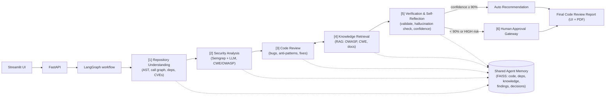

# TRIAVANI — Consolidated Project Documentation

> This document merges the project README and project status into a single reference.

## Executive Summary

TRIAVANI is an AI-assisted code review platform implementing a 6-agent architecture. The infrastructure, orchestration, UI, APIs, contracts and ingestion pipeline are production-shaped, while most AI reasoning components remain placeholder implementations.

## Current Implementation Status

| Area | Status | Notes |
|---|---|---|
| Repository Ingestion | ✅ Complete | Tree-sitter parsing, call graphs, dependency analysis, OSV lookups |
| Security Analysis | ⚠️ Partial | Semgrep integration, heuristic analysis |
| AI Code Review | ⚠️ Placeholder | Regex/mock LLM instead of real LLM |
| Knowledge Retrieval | ⚠️ Placeholder | Keyword search instead of FAISS RAG |
| Verification | ✅ Framework Complete | Confidence scoring and approval gates implemented |
| UI/API/Reporting | ✅ Complete | FastAPI, Streamlit, PDF reports |

## PRD Gap Analysis

| Goal | Target | Current State |
|---|---|---|
| G1 | Multi-language ingestion | ✅ Achieved |
| G2 | AI vulnerability detection | ⚠️ Heuristic implementation |
| G3 | Explainable fixes | ⚠️ Template-based |
| G4 | Confidence verification | ⚠️ Gate implemented; AI validation pending |
| G5 | Reports/UI | ✅ Complete |

## Architecture

```text
Repository
   ↓
Repository Understanding
   ↓
Security Analysis
   ↓
Code Review
   ↔
Knowledge Retrieval
   ↓
Verification
   ↓
Human Approval
   ↓
Reports/UI
```

## Strengths

- Modular architecture
- Stable contracts
- Fast ingestion
- Human approval workflow
- Production-ready plumbing

## Current Limitations

1. Mock LLM provider
2. Placeholder RAG
3. No benchmark evaluation
4. No real hallucination detection
5. No CodeQL integration

## Recommended Roadmap

| Priority | Task | Impact |
|---|---|---|
| High | Integrate real LLM | Highest |
| High | Replace keyword retrieval with FAISS | High |
| Medium | Evaluation harness | High |
| Medium | CodeQL support | Medium |
| Low | GNN research | Optional |

---

# Original README

# TRIAVANI — AI Software Code Reviewer & Secure Development Agent

**Hackathon PS #06** — SPOC: Munish/Naman

An agentic AI system that reviews software repositories end-to-end: it understands repo structure, detects bugs and security vulnerabilities, retrieves secure-coding knowledge, generates explainable review comments and fixes, self-verifies its own suggestions, and routes high-risk changes through a human approval gateway.

> *"A senior reviewer + security engineer in a box — with receipts (explainability) and a safety valve (human-in-the-loop)."*

Full product requirements: [`Hackathon_Problem_Statement.pptx`](Hackathon_Problem_Statement.pptx) · [`docs/architecture.md`](docs/architecture.md)

---

## Table of contents

- [Goals](#goals-hackathon-scope)
- [Architecture](#architecture-6-agent-pipeline)
- [Module status](#module-status)
- [Repository layout](#repository-layout)
- [Local setup](#local-setup)
- [Docker](#docker)
- [API reference](#api-reference)
- [Demo & test data](#demo--test-data)
- [Tests & lint](#tests-and-lint)
- [LLM providers](#llm-providers)
- [Design decisions](#design-decisions)
- [Team rules](#team-rules-from-the-prd)

---

## Goals (hackathon scope)

| # | Goal | Metric |
|---|------|--------|
| G1 | Ingest a GitHub/GitLab repo or PR and build a code context | Works on ≥2 languages (Python + Java) |
| G2 | Detect bugs, vulnerabilities & anti-patterns | Detect ≥70% of seeded issues in demo repo |
| G3 | Generate explainable reviews + suggested fixes | Every finding has Why + How + reference |
| G4 | Verifier agent scores confidence; low-confidence/high-risk → human approval | Confidence gate at 90% threshold |
| G5 | One-click Code Review Report (UI + PDF export) | Full report in < 5 min per PR |

**Non-goals:** auto-merging code without human approval, fine-tuning models, supporting more than 3 programming languages, production CI/CD deployment.

---

## Architecture (6-agent pipeline)



All modules communicate **only** through the frozen JSON contracts in [`packages/contracts/`](packages/contracts/):

| Contract | Direction | Contents |
|---|---|---|
| **C1 `CodeContext`** | Module A → B, C | repo metadata, files, functions with resolved callers/callees, dependencies with known CVEs, PR diff, vector store path |
| **C2 `Finding[]`** | Module B → C | type, severity, Why / How / suggested patch, CWE/OWASP refs, raw confidence |
| **C3 `ReviewReport`** | Module C → user | scores, verified findings, hallucination flags, human approval trail |

The repository under review is treated as **untrusted input**: TRIAVANI reads source text and metadata and generates patch *suggestions*, but never executes target repository code and never auto-applies patches.

---

## Module status

| Module | Scope | Owner | Status |
|---|---|---|---|
| **A — Ingestion & Repository Understanding** | `services/ingestion` (agent #1 + Shared Agent Memory) | Person 1 | ✅ Implemented & working |
| **B — Analysis & Knowledge Agents** | `services/analysis`, `services/knowledge` (agents #2–#4) | Person 2 | 🚧 Scaffolding — runs on Semgrep-when-available + mock LLM fallback |
| **C — Orchestration, Verification & Experience** | `services/orchestration`, `services/verification`, `services/reporting`, `apps/` (agents #5–#6, UI/report) | Person 3 | 🚧 Scaffolding — pipeline wiring, mock-based verification, UI/PDF export |

### Module A — definition of done

> Given a repo URL, produce a `CodeContext` JSON + populated vector store in **< 2 min** (PRD target).
> **Measured: 3.4 s cold** on `gothinkster/flask-realworld-example-app` (30 files, 123 functions, 20 dependencies with OSV CVEs — parse 0.42 s, deps 0.04 s, embed 0.07 s; remainder is network clone time). Per-stage timings are written to `<vector_store_path>/repo_insights.json` under `timings_seconds` on every run.

What Modules B & C receive from Module A:

- **C1 `CodeContext`** — `repo`, `files[]`, `functions[]` (with resolved `callers`/`callees`), `dependencies[]` (with `known_cves` from [OSV.dev](https://osv.dev)), `diff[]` (PR hunks), `vector_store_path`. Validated against `services/ingestion/schemas/code_context.schema.json`, a stricter superset of the frozen contract.
- **Shared Agent Memory** (`services.ingestion.memory.SharedMemory`) — a namespaced FAISS vector store (numpy fallback) with collections `code` / `deps` (written by A), `secure_knowledge` (B), `findings` (B/C), `decisions` (C). Embeddings use MiniLM if `sentence-transformers` is installed, otherwise an automatic hashing-embedder fallback.
- **Repo insights** (`<vector_store_path>/repo_insights.json`) — module map, per-function complexity, diff-touched functions, recent commits, timings.
- **Scope capping** for large repos — analysis can be capped to the PR diff plus N-hop call-graph neighbors via `services.ingestion.graphs.neighbors(...)`.

```python
from services.ingestion.memory import SharedMemory
mem = SharedMemory(ctx.vector_store_path)              # embedder auto-restored
hits = mem.search("code", "how are passwords hashed", k=5)
mem.add("secure_knowledge", texts, metadata)            # Module B writes here
mem.add("findings", ...); mem.add("decisions", ...)     # Modules B/C write here
mem.save()
```

---

## Repository layout

```
triavani/
├── apps/
│   ├── api/                FastAPI app — HTTP entry point
│   └── ui/                 Streamlit app — human-facing dashboard
├── packages/
│   ├── contracts/          Frozen C1/C2/C3 pydantic models, schemas, and mock JSON
│   └── shared/              Shared config/utilities
├── services/
│   ├── ingestion/           Module A — agent #1 (repo parsing, graphs, deps, memory)
│   ├── analysis/             Module B — agents #2–#3 (Semgrep + LLM review)
│   ├── knowledge/            Module B — agent #4 (secure-coding RAG retrieval)
│   ├── orchestration/        Module C — LangGraph pipeline wiring + run_pipeline()
│   ├── verification/         Module C — agent #5 (validation, confidence, risk gating)
│   └── reporting/            Module C — agent #6 output (report + PDF/Markdown export)
├── tests/
│   ├── unit/                per-module unit tests
│   ├── integration/         cross-module pipeline tests
│   ├── contract/            C1/C2/C3 schema conformance tests
│   └── fixtures/             sample_py / sample_java — seeded-bug test repos
├── demo_repos/
│   └── vulnerable_python_java_demo/   seeded demo repo for live walkthroughs
├── data/                    local sqlite / faiss / report artifacts (gitignored contents)
├── docs/                    architecture.md, api.md, decisions.md, team_handoff.md
├── docker-compose.yml
├── Makefile
├── pyproject.toml / requirements.txt
└── Hackathon_Problem_Statement.pptx
```

### Module A file map

```
services/ingestion/
├── config.py                caps / paths / languages (INGEST_* env overrides)
├── fetcher.py                clone (cached), GitHub PR diff, commit metadata
├── parser.py                 Tree-sitter -> functions / classes / imports (Python, Java)
├── graphs.py                  call graph, N-hop neighbors, module map, diff mapping
├── dependencies.py            requirements/pyproject/pom/gradle/Dockerfile -> OSV CVEs
├── memory.py                   namespaced vector store (FAISS/numpy) under data/faiss
├── embedder.py                 MiniLM or hashing embeddings; code/doc/dep chunking
├── context_builder.py          pipeline assembly + schema validation + insights
├── code_context_builder.py     pydantic adapter used by services.orchestration
├── repository_loader.py        request -> local path (local dir or shallow clone)
├── git_ingestion.py / local_path_ingestion.py / file_filter.py   loading + filtering
└── schemas/                    detailed C1 schema (superset of the frozen contract)
```

---

## Local setup

```bash
python3 -m venv .venv
source .venv/bin/activate       # Windows: .venv\Scripts\activate
pip install -r requirements.txt

make run-api                    # FastAPI on http://localhost:8000
make run-ui                     # Streamlit on http://localhost:8501
```

- API docs (Swagger): http://localhost:8000/docs
- UI: http://localhost:8501
- Health check: http://localhost:8000/health

### Run Module A directly

```bash
# URL or local path in, C1 JSON out
python -m services.ingestion.cli https://github.com/org/repo --pr 42 --out code_context.json
python -m services.ingestion.cli https://gitlab.com/group/proj --pr 7   # GitLab MR (IID)
python -m services.ingestion.cli tests/fixtures/sample_java
```

`--pr` works for GitHub PRs and GitLab MRs (nested groups supported; for GitLab pass the MR IID). Set `GITHUB_TOKEN` for GitHub PR mode (unauthenticated API is limited to 60 req/hr) and `GITLAB_TOKEN` for private GitLab projects.

```python
from services.ingestion.repository_loader import load_repository
from services.ingestion.code_context_builder import build_code_context

ctx = build_code_context(repo_path, run_id, branch)   # -> CodeContext (pydantic)
```

### Full pipeline (mock-first until B & C land)

```
START -> ingest_repository -> security_analysis -> code_review -> knowledge_retrieval
      -> verification -> decision_gateway -> build_report -> END
```

LangGraph is used when installed; a sequential fallback keeps local tests runnable without it. Module A's output is real; downstream agents currently use Semgrep-when-available, `MockLLMProvider`, and local OWASP/CWE notes so the end-to-end demo runs without any API keys. Real Module B/C implementations swap in with **zero pipeline changes** since the contracts are frozen.

---

## Docker

```bash
docker compose up --build
```

Docker Compose mounts a host directory into the API container as `/host_repos` (read-only) for the Streamlit "Local path" mode. Set `TRIAVANI_HOST_REPOS_DIR` and the matching volume in `docker-compose.yml` to point at your local repos folder.

---

## API reference

| Method | Endpoint | Description |
|---|---|---|
| `GET` | `/health` | Service health check |
| `POST` | `/api/reviews/run` | Start a new review run |
| `GET` | `/api/reviews/{run_id}` | Get run status/results |
| `GET` | `/api/reviews/{run_id}/report` | Get the JSON review report |
| `GET` | `/api/reviews/{run_id}/report/pdf` | Download the PDF report |
| `POST` | `/api/reviews/{run_id}/findings/{finding_id}/approve` | Approve a finding (human-in-the-loop) |
| `POST` | `/api/reviews/{run_id}/findings/{finding_id}/reject` | Reject a finding |
| `GET` | `/api/demo/status` | Demo/status check |

### Example

```bash
curl -X POST http://localhost:8000/api/reviews/run \
  -H "Content-Type: application/json" \
  -d '{"repo_path":"demo_repos/vulnerable_python_java_demo","branch":"main","use_mock":true}'

curl http://localhost:8000/api/reviews/{run_id}
curl http://localhost:8000/api/reviews/{run_id}/report
```

---

## Demo & test data

- **`demo_repos/vulnerable_python_java_demo`** — seeded SQL injection, unsafe subprocess call, hardcoded secret, Java SQL injection, and a low-risk quality issue (target for goal G2).
- **`tests/fixtures/sample_py` / `sample_java`** — Module A fixtures with seeded issues: SQL injection, `eval`, DES/ECB weak crypto, card-number logging, Log4Shell-vulnerable dependency.
- **Candidate evaluation datasets** (from the PRD, not yet wired in): Juliet Test Suite, OWASP Benchmark, Devign, Big-Vul, DiverseVul.

---

## Tests and lint

```bash
pytest                                                                              # full suite
pytest tests/unit/test_ingestion_*.py tests/integration/test_ingestion_pipeline.py  # Module A only
ruff check .
```

---

## LLM providers

`MockLLMProvider` is the default — the app boots and runs with **no API key required**.

| Provider | `LLM_PROVIDER` | Required env vars |
|---|---|---|
| Mock (default) | `mock` | none |
| OpenAI-compatible | `openai-compatible` | `OPENAI_COMPATIBLE_BASE_URL`, `OPENAI_COMPATIBLE_API_KEY`, `OPENAI_COMPATIBLE_MODEL` |
| Ollama (local) | `ollama` | `OLLAMA_BASE_URL`, `OLLAMA_MODEL` |

Real provider adapters are Module B scope.

---

## Design decisions

- Mock LLM is the default provider to avoid requiring paid API keys at boot.
- Semgrep is the primary static analysis engine, with mock fallback findings for demos. CodeQL is a planned future adapter and is intentionally not required for the first demo.
- Graph Neural Networks / learned code-graph representations are out of scope for the hackathon.
- The reviewed repository is treated as untrusted input; all patches are suggestions only — nothing is auto-applied.
- SQLite, local report files, and local vector-store artifacts keep the starter fully portable (no external database required).

---

## Team rules (from the PRD)

- Contracts **C1–C3 are frozen** for the hackathon starter; breaking one requires all-hands agreement.
- Each module can be developed independently as long as it accepts and returns the contract models — mock JSON files live in `packages/contracts/mocks/` (`mock_code_context.json`, `mock_findings.json`, `mock_review_report.json`) for parallel development and UI/API testing.
- Modules integrate at checkpoints only — never mid-sprint.
- Everything stays behind the single stable integration point:

```python
from services.orchestration.run_pipeline import run_pipeline

run_pipeline(repo_input)
```

---

## Project docs

- [`docs/architecture.md`](docs/architecture.md) — module boundaries and data flow
- [`docs/api.md`](docs/api.md) — endpoint reference
- [`docs/decisions.md`](docs/decisions.md) — architectural decision log
- [`docs/team_handoff.md`](docs/team_handoff.md) — contract freeze & integration notes
- Per-module READMEs: [`services/ingestion/README.md`](services/ingestion/README.md) · [`services/analysis/README.md`](services/analysis/README.md) · [`services/knowledge/README.md`](services/knowledge/README.md) · [`services/orchestration/README.md`](services/orchestration/README.md) · [`services/verification/README.md`](services/verification/README.md) · [`services/reporting/README.md`](services/reporting/README.md)


---

# Original Project Status

# TRIAVANI — Project Status vs. PRD

A gap analysis of the `triavani-main` codebase against the Hackathon PS #06 PRD, based on reading the actual source (not just module READMEs).

## Quick verdict

Only **Module A (ingestion)** is a real, working implementation. Everything downstream of it runs end-to-end, but on **rule-based heuristics and placeholders standing in for the "AI" parts** the PRD describes. The pipeline plumbing (contracts, orchestration, approval gate, reporting) is genuinely built — it's the *intelligence* inside each agent that's still a stub.

---

## Goal-by-goal (PRD Section 2)

| Goal | PRD target | Status | What's actually there |
|---|---|---|---|
| **G1** — Ingest repo/PR, build code context | ≥2 languages | ✅ **Done** | Real Tree-sitter parsing for Python + Java, real call graphs, real OSV.dev CVE lookups. Measured 3.4s on a real repo — beats the <2min target. |
| **G2** — Detect bugs/vulns/anti-patterns | ≥70% recall on seeded issues | ⚠️ **Partial** | Detection *runs*, but on regex/keyword heuristics, not the Code LLMs (Code Llama/DeepSeek-Coder/etc.) the PRD specifies. No recall number has actually been measured against the seeded datasets. |
| **G3** — Explainable reviews + fixes | Every finding has Why + How + reference | ⚠️ **Partial (shape only)** | The `Finding` object always has these *fields* populated — but the explanations come from canned templates tied to regex matches, not from an LLM reasoning about the specific code. |
| **G4** — Verifier scores confidence, gates at 90% | Confidence gate at 90% threshold | ⚠️ **Partial** | The gate itself is real and correctly implemented (`risk_gateway.py`, `confidence_scorer.py`). What's missing: real hallucination detection against an actual LLM's output — right now there's little for it to catch, since nothing upstream is LLM-generated yet. |
| **G5** — One-click report, UI + PDF, <5min | Full report in <5 min per PR | ✅ **Done (mechanically)** | Streamlit UI, FastAPI endpoints, and PDF export (via `reportlab`, with a raw-bytes fallback if it's not installed) all work. Speed target is trivially met since the "AI" steps are instant lookups, not real inference. |

---

## Non-goals — correctly respected

| Non-goal | Status |
|---|---|
| No auto-merge without approval | ✅ Enforced — `services/verification` never applies patches, only suggests them |
| No fine-tuning | ✅ N/A by design |
| ≤3 languages | ✅ Python + Java only, as scoped |
| No production CI/CD | ✅ Demo-only, as scoped |

---

## Agent-by-agent (6-agent architecture)

| # | Agent | PRD spec | Built | Real or mock? |
|---|---|---|---|---|
| 1 | Repository Understanding | AST, call graph, deps, CVEs | ✅ | **Real** — Tree-sitter, real dependency file parsing, real OSV CVE lookups |
| 2 | Security Analysis | Semgrep/CodeQL + LLM reasoning, CWE/OWASP, CVSS | ⚠️ | **Half-real** — Semgrep integration is genuine (runs the actual binary if installed), but silently returns nothing if Semgrep isn't present, with no LLM reasoning layer at all. CodeQL was never started — explicitly deferred in `docs/decisions.md`. |
| 3 | Code Review | Code LLM for bugs/anti-patterns/fixes | ❌ | **Mock** — `MockLLMProvider` is literally regex checks (`except:` with no type, `TODO`/`FIXME` strings) mapped to canned finding text. No Code Llama/DeepSeek/Qwen call exists anywhere in the code. |
| 4 | Knowledge Retrieval | RAG over OWASP/CWE/docs via FAISS | ❌ | **Placeholder** — `RagIndex` docstring literally says "Placeholder for a future FAISS-backed index; keyword retrieval is v1." It matches keywords against a handful of local markdown files, not a real retrieval pipeline. |
| 5 | Verification & Self-Reflection | Validate patches, detect hallucinations, confidence score | ⚠️ | **Real gate, thin substance** — the scoring/routing logic is properly implemented, but there's minimal hallucination surface to detect since nothing upstream is LLM-generated yet |
| 6 | Human Approval Gateway | Review high-risk changes, approve/reject | ✅ | **Real** — approve/reject API endpoints and routing logic work as designed |

---

## Also missing entirely

- **Graph Neural Networks / code graph representation** — explicitly dropped as out-of-scope in `docs/decisions.md`, despite being listed as a technique in the original PS.
- **Real LLM provider wiring** — `openai-compatible` and `ollama` provider options exist as config knobs (`LLM_PROVIDER` env var) but there's no evidence either path is actually implemented and exercised, only the mock path.
- **Measured recall against seeded datasets** — the PRD's core success metric (≥70% recall on Juliet/OWASP Benchmark) has no evaluation harness or logged result anywhere in the repo; only Module A has a measured benchmark (its 3.4s ingestion time).
- **DeepEval/Phoenix/MLflow eval logging** — listed as tooling in the PS, not present in `requirements.txt` or anywhere in code.

---

## Bottom line

Think of it as a fully-wired **skeleton with one real limb**. The "assembly line" — contracts, orchestration, gating, UI, reporting — is legitimately production-shaped and would accept real AI components without any interface changes (that was the whole point of freezing C1–C3 early). But the actual *reviewing intelligence* — the part a judge would care about most, i.e. "can it really catch bugs and vulnerabilities using AI" — is currently simulated by if/regex checks standing in for Code LLM calls and a real RAG index.

**Highest-leverage next step:** wire one real LLM provider into `services/analysis` and a real FAISS-backed retriever into `services/knowledge`.

